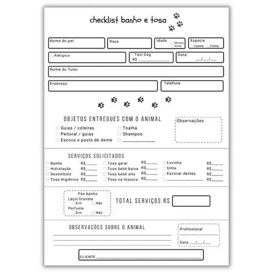

### cs_20232
Repositório definido para a manutenção do controle de versão dos artefatos do projeto de construção de uma API Rest.

### Tema
API Rest para o gerenciamento de trabalhos ofertados por um pet shop.

### Descrição
A API REST será responsável por gerenciar as operações básicas de um Petshop, como cadastro de clientes junto aos seus animais e serviços oferecidos como, por exemplo, agendamento de banho e tosa.

### Grupo
Esta API será construída pelos componentes do grupo 2:

|Matrícula|Nome|Usuário Git|
|---|---|---|
|202105030|Gabriel Camilo Silva Oliveira|[GabrielCamiloOliveira](https://github.com/GabrielCamiloOliveira)|
|202105033|Guilherme Abraão da Silva|[Guilherme-Abraao](https://github.com/Guilherme-Abraao)|
|202105034|Gustavo Morais Medeiros|[GustavoMedeiroz](https://github.com/GustavoMedeiroz)|
|202105039|Jonathan Felipe Viana Cardoso Prado|[JoJonathanF](https://github.com/JoJonathanF)|
|202105056|Wendel Márcio de Oliveira Filho|[Wendel-Fl](https://github.com/Wendel-Fl)|

### Requisitos Funcionais
1. RF001 - **Cadastro de clientes**
   - A API deverá possibilitar o cadastro de clientes, com seus dados pessoais. Com a opção de editá-lo posteriormente. O cliente deverá inserir os seguintes dados obrigatórios: Nome, Data de nascimento, telefone, endereço e e-mail. Campos opcionais: Foto, outros responsáveis pelo(s) animal(is) de estimação (nome, foto e número).
2. RF002 - **Cadastro de animais**
   - A API permitirá o cadastro dos animais a partir de uma conta de cliente. Para cada animal, deverá conter um cadastro com dados obrigatórios: nome, idade, espécie de animal e raça (a fim de definir o porte do animal, e consequentemente, a diferença de valor dos serviços ofertados).
3. RF003 - **Agendamento de banho e tosa**
   - Para banho e tosa no pet shop, o cliente deve agendar um horário disponível e preencher a ficha de dados com especificações do serviço e do animal (consultar imagem de check list ao final do documento como referência), como: que tipo de serviço (banho, tosa ou banho e tosa), se é preciso buscar o animal, profissionais escolhidos pelo cliente para ofertar o serviço e restrições de saúde informadas pelo dono e/ou analisadas pelo funcionário especializado.
4. RF004 - **Confirmação de agendamento**
   - Para cada agendamento realizado com sucesso a API criará evento na página principal com as informações de horário, data e descrição do serviço.
5. RF005 - **Cancelamento ou edição do agendamento**
   - Para cada agendamento, a API possibilitará o cancelamento ou a edição dos dados do agendamento.
6. RF006 - **Histórico**
   - O sistema deve guardar e permitir a visualização do histórico de checklists em cada pet de um determinado cliente, a fim de assegurar o estabelecimento de eventuais problemas, evidentemente sendo possível a consulta de quais profissionais foram envolvidos em um procedimento e sob quais condições o animal foi atendido.
7. RF007 - **Cálculo de comissão**
   - O sistema deve automaticamente calcular os valores das comissões individuais baseado no valor dos procedimentos realizados durante o mês e a taxa de comissão de cada funcionário (comissões de tosadores geralmente são maiores que as dos banhistas, por exemplo, 20% e 10%, respectivamente).
8. RF008 - **Avaliação de serviços**
   - Os clientes devem ter a opção de avaliar e fornecer feedback sobre os serviços prestados.

### Requisitos Não Funcionais
1. RNF001 - **Disponibilidade**
   -  O sistema deve estar disponível 24 horas por dia.
2. RNF002 - **Desempenho**
   - O sistema deve ser responsivo e finalizar com êxito todas as solicitações dos clientes.
3. RNF003 - **Pagamento**
   - O sistema deve disponibilizar as formas de pagamento mais utilizadas (cartão de crédito, cartão de débito, pix, boleto bancário, etc).
4. RNF004 - **Usabilidade**
   - O sistema deve apresentar uma interface intuitiva e de fácil aprendizado.
5. RNF005 - **Escalabilidade**
   - O sistema deve ser capaz de lidar com um aumento no número de solicitações e clientes, sem degradar o desempenho.

### Regras de Negócio
1. RN01 - Será possível realizar apenas um único cadastro por CPF.
2. RN02 - Os clientes, ao criar a conta terão que validar pelo menos um meio de contato (e-mail/telefone celular).
3. RN03 - Não será possível realizar mais de um agendamento para o mesmo animal de estimação quando houver colisão de datas e horários.
4. RN04 - Não será permitido vincular um mesmo e-mail e/ou número de telefone a contas distintas.
5. RN05 - Os trabalhos só podem ser agendados para animais de estimação cadastrados no sistema.
6. RN06 - Cada trabalho deve ter um tipo específico e duração estimada.
7. RN07 - Os clientes só podem agendar trabalhos dentro do horário de funcionamento do pet shop.
8. RN08 - O preço de cada trabalho pode variar com base no tipo de animal de estimação, tamanho ou necessidades especiais.

### Tecnologia de _Front-end_
Angular

### Tecnologia de _Back-end_
Java (Spring Boot)

### Tecnologia de Persistência de Dados
Banco de dados relacional (PostgreSQL)

### Local do _Deploy_
Deploy foi feito na AWS e Railway

Nossa API foi construída em angular(front), java(back) e necessitamos de um banco de dados para o armazenamento e persistência das informações. Dessa forma, na AWS hospedamos o front e o back, usando a EC2 em conjunto com a S3, já nosso banco de dados PostgreSQL foi hospedado na Railway.\
Segue o link para a vizualização do site: [Cerberus Paw](http://fpscs.s3-website-us-east-1.amazonaws.com/)
____

### Cronograma de Desenvolvimento

|Iteração|Tarefa|Data Início|Data Fim|Responsável|Situação|
|---|---|---|---|---|---|
|1|Planejamento|17/04/2023|05/05/2023|Grupo|Completa|
|2|Cadastro de Funcionários|06/05/2023|19/05/2023|Grupo|Completa|
|3|Cadastro de clientes e animais|20/05/2023|02/06/2023|Grupo|Programada|
|4|Agendamento(banho e tosa): criação e visualização|03/06/2023|16/06/2023|Grupo|Programada|
|5|Agendamento(banho e tosa): edição e cancelamento|17/06/2023|30/06/2023|Grupo|Programada|
|6|Histórico|01/07/2023|21/07/2023|Grupo|Programada|
|7|Cálculo de comissão, avaliação do serviço e deploy|22/07/2023|11/08/2023|Grupo|Programada| 
